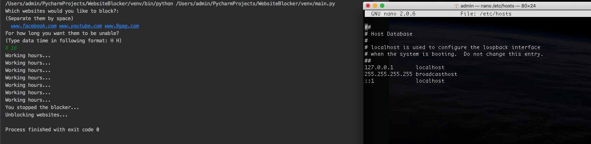

WebisteBlocker is a python script created for blocking websitets during your work hours ;). Firstly it asks user for websistes to block, then for working hours. It edits ***hosts*** file so you need to run this as administrator to make it work properly.

Note: If working hours finished or ***Ctrl+C*** pressed, script restore the orginal ***hosts*** file.

Screenshots below:

